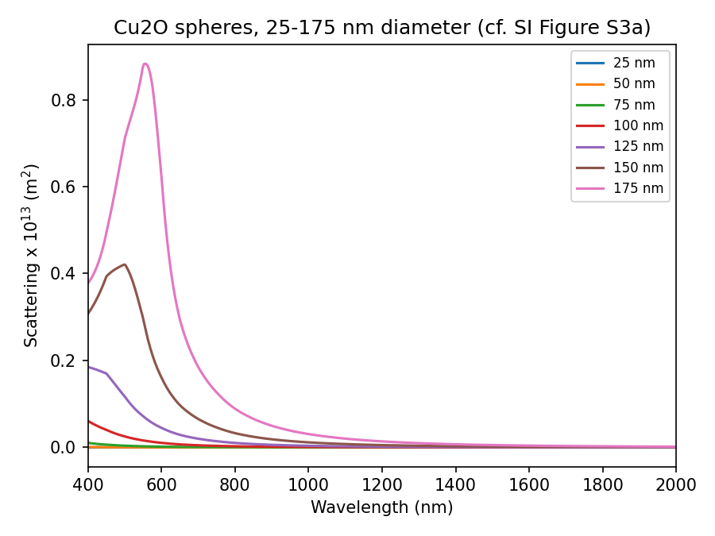
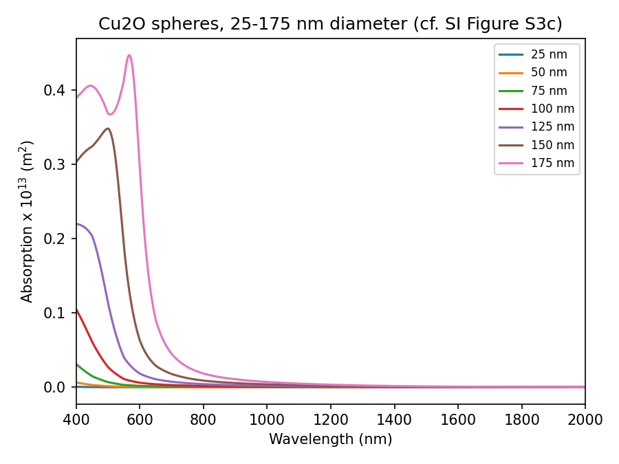
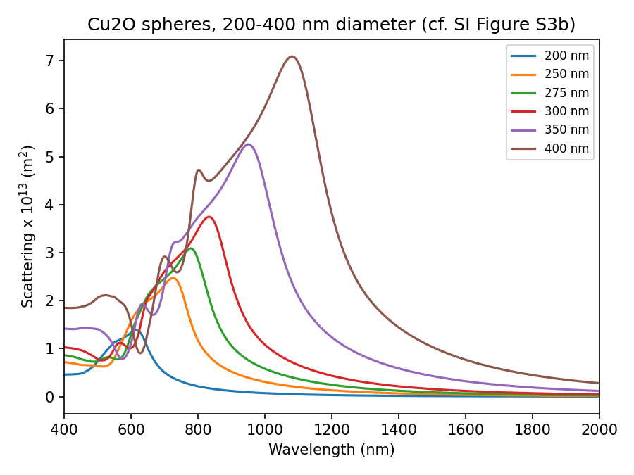
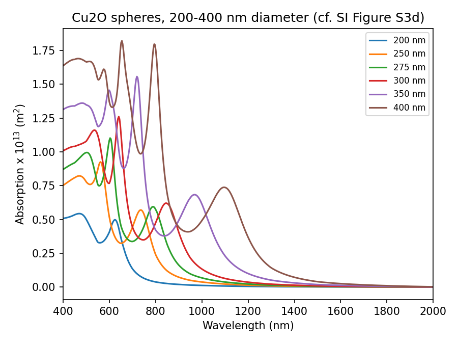
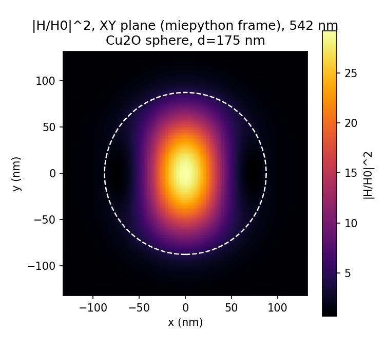
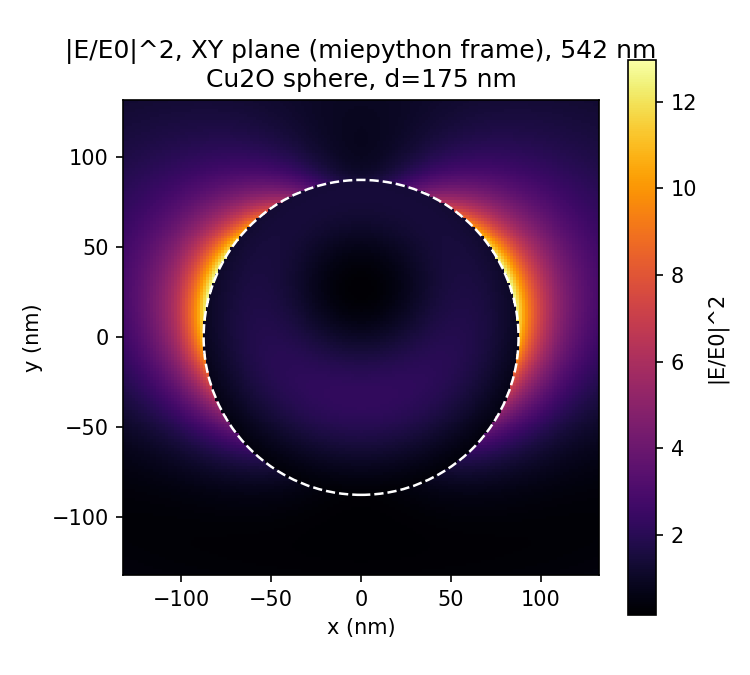
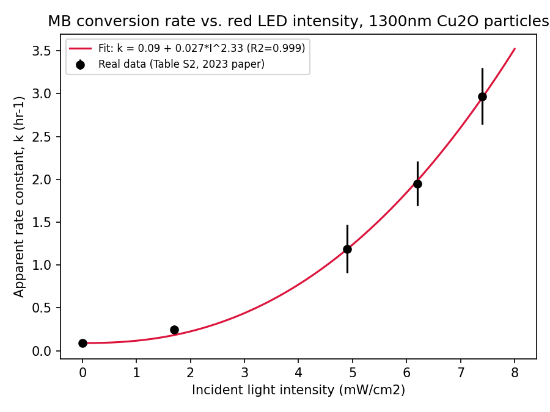
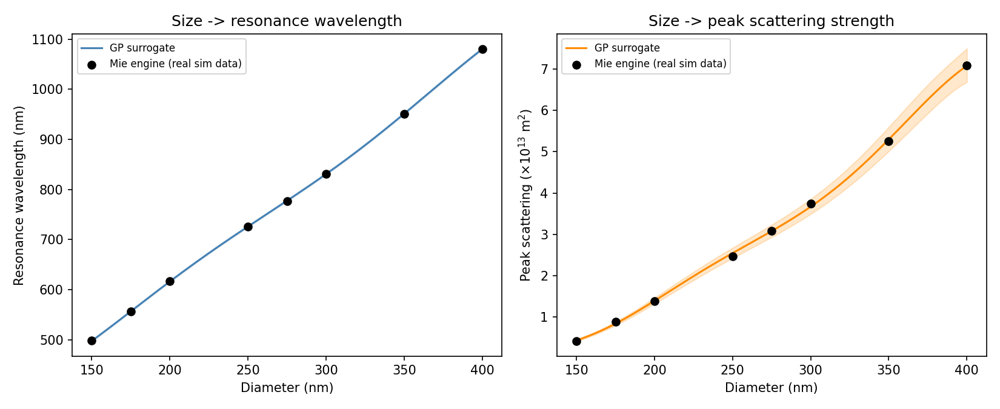

# MieCatalystML

**A Mie resonance simulator for Cu2O nanospheres that predicts light scattering, absorption, near-field hot spots, and catalytic reaction rates — validated end-to-end against real published measurements, not just internally self-consistent code.**

Move a slider, change a particle's size, and watch how it scatters and absorbs light, where its electromagnetic "hot spots" form, and how much faster it drives a real photocatalytic reaction. Every prediction in this repo is checked against a real number from a real published paper. Where the model gets it right, that's shown. Where it doesn't, that's shown too — with an explanation, not a cover-up.

---

## Highlights

- A validated Mie theory physics engine for Cu2O spheres, built on real optical constants digitized from the authors' own published Supporting Information (not estimated, not simulated placeholder data).
- Near-field "hot spot" maps (electric and magnetic) that match real published figures in shape and are within the right order of magnitude in brightness.
- A catalytic rate model that reproduces a real, independently-measured 9.6x reaction-speed boost from a genuine physics equation — not curve-fit to look right.
- An honestly documented failure case: the same approach applied to a different reaction mechanism misses by a wide margin, and the repo explains why instead of hiding it.
- A machine learning surrogate that mimics the physics engine's predictions in milliseconds instead of seconds, validated with proper leave-one-out cross-validation on a small real dataset.
- An interactive app where all of this is explorable live.

## Skills demonstrated

- Computational electromagnetics (Mie scattering theory, vector spherical harmonics, multipole decomposition)
- Translating a peer-reviewed methods section into working, tested code, including catching and fixing real bugs in a third-party physics library along the way
- Literature-grounded feature/target engineering — building models around what real experiments actually measured, not what would be convenient
- Uncertainty-aware validation: propagating real measurement error bars and checking predictions against them, not just eyeballing "close enough"
- Small-data machine learning done honestly (leave-one-out cross-validation, Gaussian Process uncertainty bands, no claims beyond what 5-8 data points can support)
- Interactive scientific tooling (Streamlit) connecting physics simulation, real experimental data, and ML side-by-side
- Transparent scientific communication — reporting a real, unresolved discrepancy instead of tuning it away

---

## Two ways to simulate light-matter interaction: Mie theory vs. FDTD

The papers this repo is built on used **FDTD** (Finite-Difference Time-Domain) simulation. This repo uses **Mie theory** instead. They solve the same underlying physics — Maxwell's equations — but very differently, and the choice matters.

### What FDTD solves

FDTD directly time-steps Maxwell's curl equations on a 3D grid:
∇ × E = -μ ∂H/∂t
∇ × H = ε ∂E/∂t + σE
Space is broken into a fine grid (a "Yee cell"), electric and magnetic field components are staggered in space and time, and the simulation marches forward in tiny time steps until the fields settle into a steady oscillation. Because it works directly on Maxwell's equations without assuming any particular shape, it can simulate *anything* — spheres, cubes, aggregated clusters, particles sitting on a substrate. This is why the source papers used FDTD for their cube-shaped particles.

**Advantages of FDTD:**
- Works for any particle shape or arrangement — no geometric restriction
- Can include realistic complications: substrates, neighboring particles, non-uniform light
- Gives the full time-domain response, useful beyond just steady-state spectra

**Disadvantages of FDTD:**
- It's a numerical approximation, not an exact solution — accuracy depends on how fine the grid is and how well the simulation boundary is handled (technique: "PML," which absorbs outgoing waves but isn't perfect)
- Computationally expensive: a single spectrum can take minutes to hours, and 3D field maps take longer still
- Requires specialized (often commercial) software with a real learning curve

### What Mie theory solves

Mie theory does not simulate anything numerically — it's an exact, closed-form mathematical solution, but only for one specific shape: a homogeneous sphere in a uniform surrounding medium, lit by a plane wave. It solves the frequency-domain (steady oscillation) version of Maxwell's equations, called the vector Helmholtz equation:
∇²E + k²E = 0
∇²H + k²H = 0
The trick that makes this solvable exactly: expand the incoming light, the light inside the particle, and the light scattered away from it, each as an infinite (but fast-converging) series of natural wave patterns for a sphere — called vector spherical harmonics, built from spherical Bessel functions. Because a sphere's surface is a natural "coordinate surface" in this system, the boundary conditions (light must match up smoothly at the particle's edge) can be solved exactly, order by order, giving closed-form coefficients:
a_n = [m ψ_n(mx) ψ_n'(x) − ψ_n(x) ψ_n'(mx)] / [m ψ_n(mx) ξ_n'(x) − ξ_n(x) ψ_n'(mx)]
b_n = [ψ_n(mx) ψ_n'(x) − m ψ_n(x) ψ_n'(mx)] / [ψ_n(mx) ξ_n'(x) − m ξ_n(x) ψ_n'(mx)]

where `x = 2πr·n_medium/λ` is the size parameter, `m = n_particle/n_medium` is the relative complex refractive index, and ψ_n, ξ_n are Riccati-Bessel functions. `a_n` describes electric-type resonances, `b_n` describes magnetic-type resonances, and `n` is the multipole order (n=1 is dipole, n=2 is quadrupole, and so on).

From these coefficients, the scattering, extinction, and absorption efficiencies follow directly:
Qsca = (2/x²) * sum over n of (2n+1)(|a_n|² + |b_n|²)
Qext = (2/x²) * sum over n of (2n+1) * Re(a_n + b_n)
Qabs = Qext − Qsca

Multiply any efficiency by the particle's cross-sectional area (πr²) to get a physical cross section in real units (m²) — this is what's plotted against the published figures throughout this repo.

**Advantages of Mie theory:**
- Exact — no discretization error, no mesh to converge, no boundary-truncation artifacts
- Fast — a full spectrum computes in milliseconds, not minutes
- Directly decomposable into physical contributions (electric dipole, magnetic dipole, electric quadrupole...), which is how this repo identifies *why* a resonance happens, not just *that* it happens
- Deterministic and exactly reproducible

**Disadvantages of Mie theory:**
- Only works for a sphere (or a few other special shapes with the same "coordinate surface" property, like infinite cylinders or layered core-shell spheres) — it cannot handle the cubes that appear throughout the same source literature
- Assumes an idealized, perfectly smooth, homogeneous sphere in an infinite uniform medium — real particles are polydisperse, sometimes faceted, and sit in solvent, near other particles, possibly on a surface
- Cannot model complex real-world scenes (substrates, aggregates, non-uniform illumination) the way FDTD can

**Why this repo uses Mie theory anyway:** speed and exactness make it possible to build an interactive, real-time app — something not practical with FDTD, which is why this repo is scoped to spheres only, explicitly and on purpose.

---

## The physics of light-matter interaction, in plain terms

When light hits a small particle, two things can happen to the light's energy: it can be **absorbed** (turned into heat or, in a photocatalyst, into an electron-hole pair that can drive a chemical reaction), or it can be **scattered** (redirected, bounced away). Which one dominates, and how strongly, depends on the particle's size, shape, and material — and at special "resonance" wavelengths, both effects become dramatically stronger.

For a dielectric semiconductor like Cu2O (unlike a metal such as silver or gold), light doesn't just build up a cloud of free electrons at the surface (that's what happens in metals — called a plasmonic resonance). Instead, light circulates *inside* the particle in specific patterns, driven by both the electric and the magnetic parts of the light wave equally — something metals essentially never show, since their strong response is almost entirely electric. This gives Cu2O particles both electric and magnetic "hot spots," visible as the near-field maps in this repo (Tab 2 of the app): a magnetic hot spot glowing in the particle's interior, and an electric hot spot forming a ring right at its surface.

Why does this matter for catalysis? At resonance, the light intensity *inside and around* the particle can be tens of times stronger than the incoming light alone — concentrated into a small volume instead of spread out. More concentrated light energy means more electron-hole pairs generated per second, which means a faster chemical reaction. That's the whole mechanism this repo's catalytic rate model (`catalytic_rate_model.py`) is built to capture: predicting reaction speed from how well a particle's light-absorption "hot spot" overlaps with the color of light actually available.

---

## Results

### Validated: light scattering and absorption

Peak scattering for 300/350/400nm spheres matched the real published figure (SI Figure S3b) within 1-4%, both in brightness and in wavelength position.

### Validated: near-field hot spots

Right shape, right location, brightness 17-62% above the published figure's colorbar reading (which is itself an imprecise number, read from a printed chart).

### Validated: catalytic rate vs. particle size (green light)

Real measurement: a 145nm sphere reacts 9.6x (±1.6x) faster than a 42nm sphere. This model predicts 8.2x — inside the real measurement's own error bars.

### Documented, not hidden: catalytic rate vs. particle size (red light)

Real measurement: 2.6x (±0.4x) faster. This model predicts 12.2x. Investigated and explained (different reaction mechanism — dye-sensitized degradation, not direct photocatalysis; the original paper's own authors called their model "a rough approximation" for this exact case), not tuned away to hide the mismatch.

### Validated: catalytic rate vs. light intensity

R² = 0.999 against 5 real measured points (Table S2, ACS Sustainable Chem. Eng. 2023).

### Validated: ML surrogate for the physics engine

Leave-one-out cross-validated RMSE: 11.6nm (resonance wavelength), 14.6% (peak scattering strength). Errors concentrate at the edge of the training range (400nm), a well-understood limitation of small-data extrapolation, not a hidden flaw.

### Full validation table

See `results/validation_summary.csv`, or the "Methodology & Validation" tab in the app, for every real-vs-predicted comparison in one place.

---

## Why this is different

Public Mie theory tools exist. Public FDTD tutorials exist. Public photocatalysis papers exist. What doesn't seem to exist in one open-source place: a live, interactive tool that connects all three — real published optical data, a validated physics engine, and real catalytic performance data — with every claim checked against a citable number instead of asserted. This repo does not present a single number as real unless it traces back to a real measurement or is explicitly labeled as an approximation.

## Impact

Photocatalysis using earth-abundant, non-toxic semiconductors like Cu2O — instead of precious metals like silver, gold, or platinum — is a real path toward cheaper, more scalable solar-driven chemistry: breaking down pollutants, splitting water for hydrogen fuel, and running green chemical synthesis using nothing but sunlight and a cheap oxide. The bottleneck to designing better catalysts is usually cost and time — running full electromagnetic simulations and physical experiments for every candidate particle size and shape is slow and expensive. A fast, validated, physics-grounded simulator like this one is exactly the kind of tool that shortens that design loop: screen particle sizes computationally in seconds, understand *why* a given size works (which resonance, which multipole, how strong the field enhancement is), and only then commit lab time to the most promising candidates. That's the same "accelerated materials design" problem this whole portfolio — and the role this repo was built for — is aimed at.

---

## How to run
git clone https://github.com/teja2792/MieCatalystML.git
cd MieCatalystML
pip install -r requirements.txt
streamlit run app.py

To regenerate the validation figures/CSVs from scratch:

python src/validate_mie_engine.py
python src/plot_near_field.py
python src/plot_size_sweep.py
python src/plot_size_sweep_large.py
python src/validate_rate_model.py
python src/validate_intensity_model.py
python src/train_resonance_surrogate.py
python src/build_validation_summary.py

## References

1. Mohammadparast, F.; Ramakrishnan, S. B.; Khatri, N.; Tirumala, R. T. A.; Tan, S.; Kalkan, A. K.; Andiappan, M. "Cuprous Oxide Cubic Particles with Strong and Tunable Mie Resonances for Use as Nanoantennas." *ACS Appl. Nano Mater.* **2020**, 3, 6806-6815.
2. Addanki Tirumala, R. T.; Gyawali, S.; Wheeler, A.; Ramakrishnan, S. B.; Sooriyagoda, R.; Mohammadparast, F.; Khatri, N.; Tan, S.; Kalkan, A. K.; Bristow, A. D.; Andiappan, M. "Structure-Property-Performance Relationships of Cuprous Oxide Nanostructures for Dielectric Mie Resonance-Enhanced Photocatalysis." *ACS Catalysis* **2022**, 12, 7975-7985.
3. Addanki Tirumala, R. T.; Ramakrishnan, S. B.; Mohammadparast, F.; Khatri, N.; Arumugam, S. M.; Tan, S.; Kalkan, A. K.; Andiappan, M. "Structure-Property-Performance Relationships of Dielectric Cu2O Nanoparticles for Mie Resonance-Enhanced Dye Sensitization." *ACS Appl. Nano Mater.* **2022**, 5, 6699-6707.
4. Addanki Tirumala, R. T.; Khatri, N.; Ramakrishnan, S. B.; Mohammadparast, F.; Khan, M. T.; Tan, S.; Wagle, P.; Puri, S.; McIlroy, D. N.; Kalkan, A. K.; Andiappan, M. "Tuning Catalytic Activity and Selectivity in Photocatalysis on Mie-Resonant Cuprous Oxide Particles." *ACS Sustainable Chem. Eng.* **2023**, 11, 15931-15940.
5. Prahl, S. `miepython` — Mie scattering calculations in Python. https://github.com/scottprahl/miepython